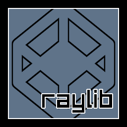

# rayjule
Raylib bindings for [Jule](https://jule.dev/) v0.2.0

> [!WARNING]
> This is still a WIP and has only been tested on Windows so far, so please be aware. If you’re on a different OS and want to help, contributions are welcome.

## Getting Started
First make sure you have the latest version of [Jule](https://jule.dev/downloads) installed. 0.2.0 is the latest at the time of writing.
Then create a new folder and create a Jule module via `julec mod init <module name>`
Once you have that clone this repository
```
git clone https://github.com/SabeDoesThings/rayjule
```
and copy the windows.jule file into your main directory.
This is has all the compiler flags needed to run on Windows.
There currently is not one for Linux or Mac OS because it has not been tested on those platforms at the moment.

Once you have that create a `main.jule` file and put this code:
```v
use rl "<module name>/rayjule"

fn main() {
   const screenWidth = 800
   const screenHeight = 450

   rl::InitWindow(screenWidth, screenHeight, "raylib [core] example - basic window")

   rl::SetTargetFPS(60)

   for !rl::WindowShouldClose() {
      rl::BeginDrawing()
         rl::ClearBackground(rl::RAYWHITE)
         rl::DrawText("Congrats! You created your first window!", 190, 200, 20, rl::LIGHTGRAY)
      rl::EndDrawing()
   }

   rl::CloseWindow()
}
```
Then just do `julec build .` and it should run.

## Examples
You can find more examples in the [examples](https://github.com/SabeDoesThings/rayjule/tree/main/examples) folder.

Examples Todo:
- [x] sprite_animation
- [ ] background_scrolling
- [ ] 2d_camera
- [ ] 2d_camera_platformer
- [ ] 3d_camera_first_person
- [ ] 3d_camera_fps
